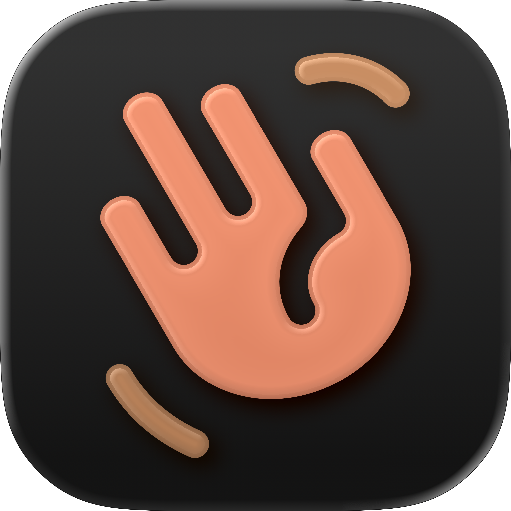
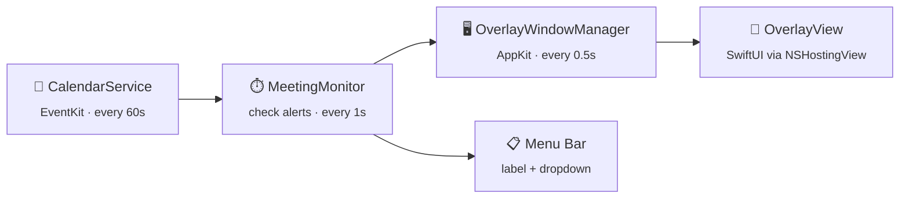

<div align="center">
  
  <h1>Screen Slap</h1>
  <p><em>Never miss a meeting again.<br>A full-screen overlay that blocks your screen before calendar events start.</em></p>

  [](https://www.apple.com/macos/)
  [](https://swift.org/)
  [](https://developer.apple.com/xcode/swiftui/)
</div>

<br>

> [!NOTE]
> A native macOS menu bar app that monitors your calendars and throws a full-screen overlay across **all displays** when a meeting is about to start — complete with join, snooze, and dismiss controls. Inspired by [In Your Face](https://inyourface.app) by Martin Hoeller.

## Features

- **Full-screen overlay** — covers every display at `screenSaver` window level so you can't ignore it
- **Smart meeting URL detection** — extracts video call links from 12 providers (Zoom, Google Meet, Teams, Webex, Slack, GoTo, Whereby, Skype, Jitsi, FaceTime, Discord, and custom)
- **One-click join** — opens the meeting link directly in your browser or a per-provider app
- **Snooze & dismiss** — push the alert back or dismiss it entirely
- **Per-provider link handlers** — configure which app opens each meeting type (e.g. open Zoom links in Zoom.app)
- **Multi-monitor support** — overlay appears on all connected displays simultaneously
- **Menu bar countdown** — shows your next meeting name and time remaining at a glance
- **Upcoming meetings list** — dropdown with color-coded calendar dots, time badges, and join buttons
- **Configurable alert timing** — choose 1–15 minutes before meeting start
- **Calendar filtering** — enable or disable specific calendars
- **Launch at login** — optional auto-start via `SMAppService`
- **Alert sounds** — customizable notification sound when the overlay appears
- **Attendee avatars** — resolves contact photos from your address book

## How It Works



1. **CalendarService** fetches events from EventKit every 60 seconds
2. **MeetingMonitor** checks cached events every 1 second against the alert window
3. When a meeting enters the alert window, `activeAlert` is set
4. **OverlayWindowManager** syncs every 0.5 seconds — when an alert appears, it creates borderless `NSWindow`s at `.screenSaver` level on every display
5. **OverlayView** (SwiftUI hosted via `NSHostingView`) shows meeting details with join, snooze, and dismiss buttons
6. The **menu bar label** updates in real-time with the next meeting name and countdown

## Getting Started

### Download

1. Grab the latest `.dmg` from [Releases](https://github.com/danielkuhlwein/screen-slap/releases)
2. Open the DMG and drag **Screen Slap** to Applications
3. Launch from Applications — that's it!

On first launch, Screen Slap will request **Calendar** access. Grant it in System Settings → Privacy & Security → Calendars.

<details>
<summary><strong>Build from Source</strong></summary>

<br>

```bash
git clone https://github.com/danielkuhlwein/screen-slap.git
cd screen-slap
open screen-slap.xcodeproj
```

In Xcode, select the **screen-slap** scheme, update **Signing & Capabilities** with your own team, and press <kbd>Cmd</kbd>+<kbd>R</kbd>.

</details>

## Configuration

Open **Settings** from the menu bar dropdown (gear icon) to configure:

| Tab | Options |
|-----|---------|
| **General** | Alert timing (1–15 min before), snooze duration, auto-join, alert sound, launch at login, look-ahead days |
| **Calendars** | Toggle which calendars trigger alerts |
| **Link Handlers** | Map each meeting provider to a specific app (e.g. Zoom → zoom.us) |
| **About** | Version info, check for updates |

## Testing

```bash
cd screen-slap
xcodebuild test -project screen-slap.xcodeproj -scheme screen-slap -destination 'platform=macOS'
```

Runs 107 tests across 4 suites covering URL parsing, event model logic, monitor state machine, and settings persistence.

<details>
<summary><strong>Project Structure</strong></summary>

<br>

```
.
├── screen-slap/
│   ├── screen_slapApp.swift              # App entry point, MenuBarExtra, monitor bootstrap
│   ├── Models/
│   │   ├── AppSettings.swift             # UserDefaults-backed settings singleton
│   │   └── MeetingEvent.swift            # Value type decoupled from EKEvent
│   ├── Services/
│   │   ├── CalendarService.swift         # EventKit wrapper, permissions, event fetching
│   │   ├── CalendarServiceProtocol.swift # Protocol for mock injection in tests
│   │   ├── ContactResolver.swift         # Resolves attendee photos from Contacts
│   │   ├── MeetingMonitor.swift          # Timer-driven state machine (fetch + alert check)
│   │   ├── MeetingURLParser.swift        # Extracts meeting URLs from 12 providers
│   │   ├── OverlayWindowManager.swift    # AppKit bridge — multi-monitor NSWindow management
│   │   └── SoundManager.swift            # Alert sound playback
│   ├── Views/
│   │   ├── MenuBarView.swift             # Menu bar dropdown with meeting list
│   │   ├── OverlayView.swift             # Full-screen alert overlay (SwiftUI)
│   │   ├── SettingsView.swift            # Tabbed preferences window
│   │   ├── CalendarPermissionView.swift  # Calendar access request prompt
│   │   └── Components/
│   │       └── CountdownLabel.swift      # Live countdown timer component
│   ├── Utilities/
│   │   └── Constants.swift               # App-wide constants and defaults
│   └── Assets.xcassets/                  # App icon and colors
├── screen-slapTests/
│   ├── MockCalendarService.swift         # CalendarServiceProtocol mock
│   ├── MeetingURLParserTests.swift       # 40 tests — all providers, edge cases
│   ├── MeetingEventTests.swift           # 22 tests — model, equality, formatting
│   ├── MeetingMonitorTests.swift         # 23 tests — state machine, snooze, dismiss
│   └── AppSettingsTests.swift            # 16 tests + constants validation
└── .gitignore
```

</details>

## License

MIT — do whatever you want with it.
